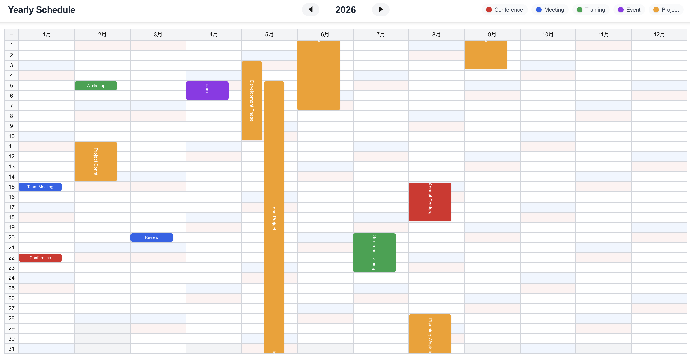

# react-yearly-calendar-grid

A React component that displays a yearly calendar grid. Supports drag & drop for moving and resizing events.

[Japanese / 日本語](./README.ja.md)



## Installation

```bash
npm install react-yearly-calendar-grid
```

## Basic Usage

```tsx
import { YearlyCalendar, CalendarEvent } from 'react-yearly-calendar-grid';

const events: CalendarEvent[] = [
  {
    id: '1',
    date: new Date(2026, 0, 15),
    title: 'Meeting',
    category: 'work',
  },
  {
    id: '2',
    date: new Date(2026, 1, 10),
    endDate: new Date(2026, 1, 14),
    title: 'Business Trip',
    category: 'travel',
  },
];

const categoryColors = {
  work: '#2563eb',
  travel: '#16a34a',
};

function App() {
  return (
    <div style={{ height: '100vh' }}>
      <YearlyCalendar
        year={2026}
        events={events}
        categoryColors={categoryColors}
        onEventClick={(event) => console.log('Clicked:', event)}
        onDateClick={(date, events) => console.log('Date:', date, events)}
        onEventMove={(event, newStart, newEnd) => {
          console.log('Moved:', event.title, 'to', newStart);
        }}
      />
    </div>
  );
}
```

## Props

| Prop | Type | Required | Description |
|------|------|----------|-------------|
| `year` | `number` | Yes | The year to display |
| `events` | `CalendarEvent[]` | No | Array of events |
| `holidays` | `Holiday[]` | No | Array of holidays |
| `categoryColors` | `Record<string, string>` | No | Colors for each category |
| `theme` | `ThemeColors` | No | Theme color settings |
| `highlightRange` | `{ start: Date; end: Date } \| null` | No | Date range to highlight |
| `showWeekday` | `boolean` | No | Show weekday label in the top-right corner of each cell |
| `onDateClick` | `(date: Date, events: CalendarEvent[]) => void` | No | Called when a date is clicked |
| `onDateDoubleClick` | `(date: Date, events: CalendarEvent[]) => void` | No | Called when a date is double-clicked |
| `onDateRangeSelect` | `(startDate: Date, endDate: Date) => void` | No | Called when a date range is selected |
| `onEventClick` | `(event: CalendarEvent) => void` | No | Called when an event is clicked |
| `onEventMove` | `(event, newStartDate, newEndDate) => void` | No | Called when an event is moved or resized |

## CalendarEvent

```ts
interface CalendarEvent {
  id: string;          // Unique ID
  date: Date;          // Start date
  endDate?: Date;      // End date (for multi-day events)
  title: string;       // Title
  color?: string;      // Individual color (overrides categoryColors)
  category?: string;   // Category (use categoryColors to specify color)
}
```

## Holiday

```ts
interface Holiday {
  date: Date;   // Holiday date
  name: string; // Holiday name
}
```

### Holidays Example

```tsx
import { YearlyCalendar, Holiday } from 'react-yearly-calendar-grid';

const holidays: Holiday[] = [
  { date: new Date(2026, 0, 1), name: "New Year's Day" },
  { date: new Date(2026, 11, 25), name: 'Christmas' },
];

function App() {
  return (
    <YearlyCalendar
      year={2026}
      holidays={holidays}
      theme={{
        bgHoliday: '#fef2f2', // Holiday background color
      }}
    />
  );
}
```

## Features

### Drag & Drop
Drag events to move them to different dates. Multi-day events maintain their duration when moved.

### Resize
Drag the top or bottom edge of multi-day events to extend or shorten their duration.

### Cross-Month Display
Events spanning multiple months are displayed continuously across each month.

### Date Range Selection
Click and drag across dates to select a date range.

## Theme Customization

All theme properties are optional. Only specify the properties you want to override - unspecified properties will use default values.

```tsx
<YearlyCalendar
  year={2026}
  events={events}
  theme={{
    bgSunday: '#ffe4e6',       // Sunday background color
    bgSaturday: '#e0f2fe',     // Saturday background color
    bgHoliday: '#fef2f2',      // Holiday background color
    buttonPrimary: '#059669',  // Button color
    tooltipBg: '#1f2937',      // Tooltip background
  }}
/>
```

### ThemeColors

| Property | Description | Default |
|----------|-------------|---------|
| `bgWhite` | Normal cell background | `#ffffff` |
| `bgGray50` | Hover background | `#f9fafb` |
| `bgGray100` | Header background | `#f3f4f6` |
| `bgSunday` | Sunday background | `#fef2f2` |
| `bgSaturday` | Saturday background | `#eff6ff` |
| `bgHoliday` | Holiday background | `#fef2f2` |
| `bgDropHighlight` | Drop target highlight | `rgba(191, 219, 254, 0.5)` |
| `borderDefault` | Border color | `#d1d5db` |
| `borderDropHighlight` | Drop target border | `#3b82f6` |
| `textPrimary` | Main text color | `#111827` |
| `textSecondary` | Secondary text color | `#4b5563` |
| `textMuted` | Muted text color | `#6b7280` |
| `tooltipBg` | Tooltip background | `#111827` |
| `tooltipText` | Tooltip text color | `#ffffff` |
| `buttonPrimary` | Button background | `#2563eb` |
| `buttonPrimaryHover` | Button hover background | `#1d4ed8` |
| `floatingDateBg` | Dragging date display background | `#2563eb` |
| `resizeFloatingBg` | Resizing date display background | `#9333ea` |

## Event Move Implementation Example

```tsx
import { useState, useCallback } from 'react';
import { YearlyCalendar, CalendarEvent } from 'react-yearly-calendar-grid';

function App() {
  const [events, setEvents] = useState<CalendarEvent[]>([
    { id: '1', date: new Date(2026, 0, 15), title: 'Event 1' },
  ]);

  const handleEventMove = useCallback(
    (event: CalendarEvent, newStartDate: Date, newEndDate: Date | undefined) => {
      setEvents((prev) =>
        prev.map((e) =>
          e.id === event.id
            ? { ...e, date: newStartDate, endDate: newEndDate }
            : e
        )
      );
    },
    []
  );

  return (
    <YearlyCalendar
      year={2026}
      events={events}
      onEventMove={handleEventMove}
    />
  );
}
```

## Notes

- Set a height on the container (e.g., `height: 100vh`)
- The calendar expands to fill its parent element
- No external dependencies (only React/ReactDOM as peerDependencies)

## License

MIT
